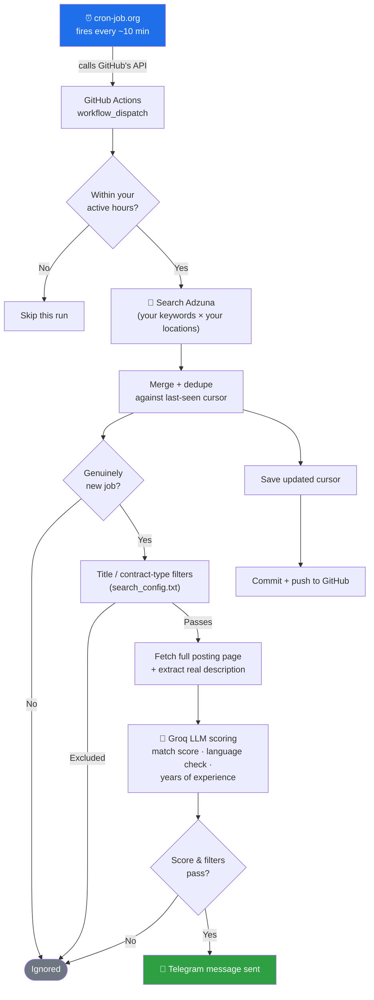

# Job Alert Bot

A free, fully automated job alert bot. It searches Adzuna on a schedule,
filters out roles you don't want, scores each remaining job against your
own profile using an LLM, and sends you a Telegram message for every
genuinely new match — no manual searching, no daily digest email, no
missed postings.

It ships pre-configured as an example for data science roles in Germany,
but nothing about it is data-science-specific or Germany-specific —
every search parameter (keywords, locations, country, exclusion rules,
match threshold) lives in a single plain-text file, `search_config.txt`,
so you can repoint it at any role, any country Adzuna covers, in a few
minutes.

## How it works



**Input**: your search config + your candidate profile.
**Middle**: Adzuna search → dedupe → title/contract filters → full-page
fetch → LLM scoring against your profile.
**Output**: a Telegram message for every job that clears all the
filters — nothing else.

## What a message looks like

```
🔴🔴🔴 NEW BATCH — 3 ROLES 🔴🔴🔴
06 Aug 2026, 02:15 PM

🇩🇪 Germany — New role

Senior Data Analyst (m/w/d)
Example GmbH · Munich, Bavaria

🕒 Posted: 06 Aug 2026, 01:47 PM

💰 65,000–80,000

🎯 Match: 8/10 — Strong analytics and stakeholder-facing
experience aligns well with this role.

🇩🇪 German: Not mandatory, English OK

📅 Experience: 3+ years

https://www.adzuna.de/details/1234567890
```

Each field is generated automatically: title/company/location and
posted-time come straight from Adzuna, salary shows only when Adzuna has
it, and match score / language requirement / years-of-experience are all
extracted by the LLM from the real job posting — not just Adzuna's
(often truncated) summary.

## Heads up on the first run

The very first run has no history, so it will send you every currently
matching job it finds in one burst. After that, it only alerts on
genuinely new postings. If you'd rather skip the initial flood, edit
`state/combined.json` before your first run and set `last_seen_iso` to
right now, e.g. `"2026-08-06T12:00:00Z"` — that makes the first run
start clean.

## 1. Get a free Adzuna API key

1. Go to https://developer.adzuna.com/ and register for a free account.
2. Once approved, your dashboard shows an `App ID` and `App Key`.
3. Keep both handy for step 4.

## 1b. Get a free Groq API key (for job match scoring)

1. Go to https://console.groq.com/ and sign up (free tier available).
2. Create an API key from the dashboard.
3. Keep it handy for step 4.

Groq scores each new job against your profile, extracts the actual
language requirement from the real job posting (not just Adzuna's
summary), and pulls out the required years of experience — all three
shown in the Telegram message. Uses `openai/gpt-oss-20b` — fast and
cheap, tuned to fit inside the free tier's rate limits (adjustable in
`search_config.txt`). If scoring fails for a given job, the job is still
sent — just without a score line — rather than being dropped.

## 1c. Write your candidate profile

Your profile is what the LLM compares every job against — the more
specific and concrete, the better the match scoring. It's stored as a
GitHub Secret (`CANDIDATE_PROFILE`, set up in step 4), not committed to
the repo, so your career details aren't exposed even if the repo is
public.

**Example format** (write your own — this is illustrative, not a
template to fill in blank-by-blank):

```
Marketing professional with experience spanning B2B SaaS growth
marketing, lifecycle/CRM campaigns, and marketing analytics.

Key experience:
- Led a lifecycle marketing program for a mid-market SaaS company,
  redesigning onboarding email flows and improving trial-to-paid
  conversion by ~18% over two quarters.
- Built and maintained attribution/reporting dashboards (SQL + Looker)
  used by the whole go-to-market team to prioritize channel spend.
- Ran paid acquisition campaigns across Google Ads and LinkedIn Ads
  with a combined budget of ~$40k/month, consistently hitting CAC
  targets.
- Managed a CRM database of 200k+ contacts, including segmentation
  and re-engagement campaigns that recovered ~2,000 dormant leads/quarter.
- Core skills: campaign strategy, marketing analytics, SQL, A/B testing,
  CRM platforms (HubSpot), paid acquisition, cross-functional
  collaboration with sales and product.

Target roles: Growth Marketing, Marketing Analytics, Lifecycle/CRM
Marketing, Marketing Manager. Currently based in Amsterdam, Netherlands.
```

Plain text, no special formatting needed — just paste the equivalent for
your own background directly into the `CANDIDATE_PROFILE` secret value
(no surrounding quotes).

## 2. Create a Telegram bot and get your chat ID

1. In Telegram, message **@BotFather** → `/newbot` → follow the prompts.
   BotFather gives you a **bot token** (looks like `123456:ABC-DEF...`).
2. Start a chat with your new bot (search its username, hit Start) and
   send it any message — this is required so it's allowed to message you.
3. Get your **chat ID**: message **@userinfobot** on Telegram directly —
   it instantly replies with your numeric user ID, which is your chat ID
   for a private chat. (Alternative: visit
   `https://api.telegram.org/bot<TOKEN>/getUpdates` in a browser right
   after messaging your bot, and look for `"chat":{"id": ...}` in the
   response.)

## 3. Push this project to GitHub

1. Create a new GitHub repo (private or public — see the note on public
   repos under "Tuning it" below).
2. Push this folder's contents to it.

## 4. Add your secrets

In the repo: **Settings → Secrets and variables → Actions → New repository secret**.
Add these five:

| Secret name | Value |
|---|---|
| `ADZUNA_APP_ID` | from step 1 |
| `ADZUNA_APP_KEY` | from step 1 |
| `GROQ_API_KEY` | from step 1b |
| `CANDIDATE_PROFILE` | from step 1c |
| `TELEGRAM_BOT_TOKEN` | from step 2 |
| `TELEGRAM_CHAT_ID` | from step 2 |

## 5. Enable the workflow

Go to the **Actions** tab in your repo → you should see "Data Science Job
Alert" (the workflow's internal name — feel free to rename it in
`job-alert.yml` to something more general) → click **Enable workflow**
if prompted.

## 6. Set up the external scheduler (cron-job.org)

GitHub's own native `schedule:` cron trigger proved unreliable in testing
— it would silently stop firing for many hours at a time, especially
after any edit to the workflow file. `workflow_dispatch` (manual runs),
on the other hand, fired instantly and reliably every single time. So
instead of depending on GitHub's scheduler, we use a free external cron
service to call `workflow_dispatch` via GitHub's API on a schedule.

**Step A — create a GitHub Personal Access Token (PAT):**

1. Go to https://github.com/settings/personal-access-tokens/new
2. Give it a name like `job-alert-dispatch`.
3. Under "Repository access," select **Only select repositories** →
   choose your repo.
4. Under "Permissions" → "Repository permissions" → set **Actions** to
   **Read and write**.
5. Generate the token and copy it somewhere safe — you won't see it
   again. Treat it like a password.

**Step B — set up cron-job.org:**

1. Go to https://cron-job.org/ and create a free account.
2. Create a new cron job with these settings:
   - **URL**:
     `https://api.github.com/repos/<your-username>/<your-repo>/actions/workflows/job-alert.yml/dispatches`
   - **Request method**: POST
   - **Headers**:
     - `Authorization: Bearer <your PAT from step A>`
     - `Accept: application/vnd.github+json`
     - `Content-Type: application/json`
   - **Body**: `{"ref":"main"}`
   - **Schedule**: every 10 minutes (or your preference), restricted to
     your active hours (cron-job.org supports timezone-aware schedules —
     set your local timezone and active window, and it handles daylight
     saving automatically without any manual UTC math).
3. Save and enable the job. cron-job.org shows execution history, so you
   can confirm it's actually firing and see GitHub's response.

The "Check active hours" step still exists inside the workflow itself as
a redundant safety net (in case the external schedule ever misfires
outside your intended hours), but the real scheduling now lives in
cron-job.org, not GitHub.

## Tuning it

- **Everything search-related** — keywords, exclusions, locations,
  match threshold, Adzuna country, Groq model, and rate-limit pacing —
  lives in `search_config.txt` at the repo root. Plain text, no code
  involved. Each setting lives under its own `[SECTION]` header; add or
  remove lines to change it. Lines starting with `#` are comments.
  Commit and push after editing; the next run picks it up automatically.
  If the file is missing or a section is empty, the bot falls back to
  sensible built-in defaults rather than failing.
- **Your profile** (for match scoring): update the `CANDIDATE_PROFILE`
  GitHub Secret — see step 1c above.
- **Frequency**: handled by your cron-job.org schedule now, not GitHub's
  native cron (see "Set up the external scheduler" above) — edit the
  schedule there.
- **Making the repo public**: GitHub Actions minutes are unlimited/free
  on public repos (private repos get a limited free monthly quota).
  Safe to do since `CANDIDATE_PROFILE` and all API keys are GitHub
  Secrets, never committed to the repo — but do a quick skim of your
  repo's file list first to be sure nothing else personal snuck in.

## Why this architecture (vs. scraping LinkedIn/Indeed directly)

Adzuna is an official, documented API meant for exactly this kind of
programmatic use — no risk of account bans or broken scrapers when a
site changes its HTML. State (the "have I already alerted on this"
tracking) lives in a small JSON file committed back to the repo by the
workflow itself, so nothing needs an external database.
