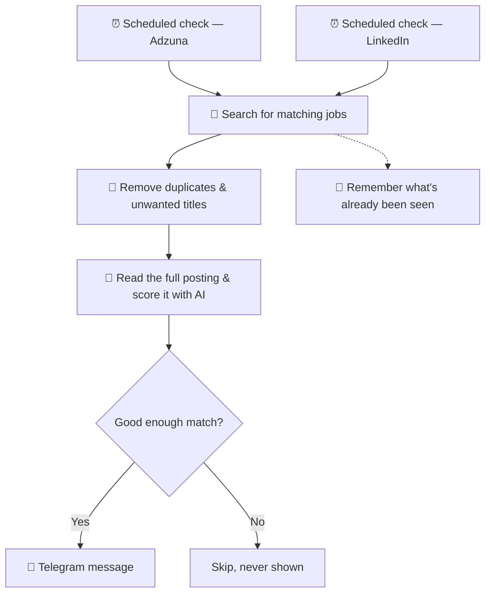

# Job Alert Bot

A free, fully automated job alert. It checks for new job postings on a
schedule, throws out roles you don't want, uses AI to judge how well each
remaining job actually fits your background, and sends you a Telegram
message for every genuinely new match. No manual searching, no daily
digest email to skim through, no missed postings because you didn't check
that day.

It runs in the cloud (on GitHub's free infrastructure), so it keeps
checking around the clock even when your own computer is switched off.

## Why two sources?

No single job site has everything. This bot checks **two** sources every
run, so a posting only has to appear on *one* of them to reach you:

- **Adzuna** — not a job board itself, but a search engine that crawls and
  aggregates listings from thousands of other sources: company career
  pages, recruitment agencies, niche boards, and job sites across 16+
  countries. Its strength is breadth — it catches postings you'd otherwise
  only find by visiting dozens of individual company websites.
- **LinkedIn** — the single largest destination for job postings overall,
  and many companies post exclusively there without ever syndicating to
  aggregators like Adzuna. Its strength is postings Adzuna simply never
  sees.

Run separately, each source has blind spots. Run together, they cover for
each other — which is the whole point of building it this way rather than
picking just one. Both feed into the same Telegram chat, scored against
the same profile, so you get one unified stream of relevant jobs regardless
of which site they came from.

## How it works



In plain terms: twice on their own schedules, the bot looks for jobs
matching your target roles on Adzuna and on LinkedIn, throws out anything
you've already been told about or explicitly don't want (internships,
wrong job titles, etc.), reads the full text of everything left, asks an AI
model to judge the fit against your actual background, and only messages
you about the ones worth your time.

## What a message looks like

**From Adzuna:**
```
💼 NEW BATCH - 3 ROLES 💼
06 Aug 2026, 02:15 PM

🇩🇪 Germany - New role

Senior Data Analyst (m/w/d)
Example GmbH · Munich, Bavaria

🕒 Posted: 06 Aug 2026, 01:47 PM

💰 65,000–80,000

🎯 Match: 8/10 - Strong analytics and stakeholder-facing
experience aligns well with this role.

🇩🇪 German: Not mandatory, English OK

📅 Experience: 3+ years

https://www.adzuna.de/details/1234567890
```

**From LinkedIn** (same idea, no salary field — LinkedIn's public listings
don't reliably expose one — and the posting date has no time-of-day,
because LinkedIn's search results don't provide one):
```
🔗 LinkedIn — New role

Data Scientist
Acme GmbH · Berlin, Germany

🕒 Posted: 11 Aug 2026

🎯 Match: 8/10 — Strong SQL, A/B testing, and marketing
analytics experience align well with this role.

🇩🇪 German: Not mentioned

📅 Experience: 2+ years

https://www.linkedin.com/jobs/view/1234567890
```

Every field is generated automatically. Title, company, location, and
posting date come straight from the source. Salary shows only when
Adzuna provides one. The match score, language requirement, and years of
experience are all read by the AI directly from the *actual full job
posting* — not just whatever short summary the source's listing page
shows.

## Heads up on the first run

**Adzuna**: the very first run has no history, so it sends you every
currently matching job it finds, in one burst. After that, it only alerts
on genuinely new postings. If you'd rather skip that initial flood, edit
`state/combined.json` before your first run and set `last_seen_iso` to
right now, e.g. `"2026-08-06T12:00:00Z"` — that makes the first run start
clean.

**LinkedIn**: no action needed — its first run automatically recognizes
it has no history, quietly records everything currently open as "already
known," and sends you one short confirmation message instead of a flood.
From the next run on, you'll only be alerted about genuinely new postings.

## Steps to set it up

Don't worry if you've never touched code before — every step below is
clicking through websites and pasting values into forms, no programming
required.

### 1a. Get a free Adzuna key (for the Adzuna source)

1. Go to https://developer.adzuna.com/ and register for a free account.
2. Once approved, your dashboard shows an `App ID` and `App Key` — two
   short codes that let the bot use Adzuna's search on your behalf.
3. Keep both handy for step 4.

*(Only want the LinkedIn source? You can skip this step — see "Only want
one source?" near the end of step 5.)*

### 1b. Get a free Groq key (powers the AI scoring for both sources)

1. Go to https://console.groq.com/ and sign up (free tier available).
2. Create an API key from the dashboard — a long text string that lets the
   bot ask an AI model to read and score each job for you.
3. Keep it handy for step 4.

This key is what lets the bot score each new job against your profile,
pull out the real language requirement from the actual posting (not just
a summary), and figure out the required years of experience — all shown
in the Telegram message. It's tuned to stay comfortably inside the free
tier's limits. If scoring ever fails for a particular job, that job still
gets sent to you, just without a score line, rather than being silently
dropped.

### 1c. Write your candidate profile (used by both sources)

This is the one piece of writing you actually do. It's what the AI
compares every job against — the more specific and concrete, the better
the matching. It's stored as a private GitHub Secret (set up in step 4),
never written into the project's files, so your career details stay
private even if you make the repo public later.

**Example** (write your own — this is just to show the style, not a
template to fill in blank-by-blank):

```
Marketing professional with experience spanning B2B SaaS growth
marketing, lifecycle/CRM campaigns, and marketing analytics.

Key experience:
- Led a lifecycle marketing program for a mid-market SaaS company,
  redesigning onboarding email flows and improving trial-to-paid
  conversion by ~18% over two quarters.
- Built and maintained attribution/reporting dashboards (SQL + Looker)
  used by the whole go-to-market team to prioritize channel spend.
- Ran paid acquisition campaigns across Google Ads and LinkedIn Ads
  with a combined budget of ~$40k/month, consistently hitting CAC
  targets.
- Managed a CRM database of 200k+ contacts, including segmentation
  and re-engagement campaigns that recovered ~2,000 dormant leads/quarter.
- Core skills: campaign strategy, marketing analytics, SQL, A/B testing,
  CRM platforms (HubSpot), paid acquisition, cross-functional
  collaboration with sales and product.

Target roles: Growth Marketing, Marketing Analytics, Lifecycle/CRM
Marketing, Marketing Manager. Currently based in Amsterdam, Netherlands.
```

Just plain text, no special formatting needed — write the equivalent for
your own background and paste it into the `CANDIDATE_PROFILE` secret
value in step 4 (no surrounding quotes).

### 2. Create a Telegram bot and get your chat ID

This is the "phone number" the bot uses to message you.

1. In Telegram, message **@BotFather** → send `/newbot` → follow the
   prompts. BotFather gives you a **bot token** (looks like
   `123456:ABC-DEF...`) — this is your bot's password, keep it private.
2. Start a chat with your new bot (search for its username, hit Start)
   and send it any message — Telegram requires this before a bot is
   allowed to message you first.
3. Get your **chat ID**: message **@userinfobot** on Telegram directly —
   it instantly replies with your numeric user ID, which is your chat ID
   for a private chat. (Alternative: visit
   `https://api.telegram.org/bot<TOKEN>/getUpdates` in a browser right
   after messaging your bot, and look for `"chat":{"id": ...}` in the
   response.)

### 3. Put this project on GitHub

GitHub is where the bot's code lives and where it actually runs from —
free, and independent of your own computer.

1. Create a new GitHub repository (private or public — see "Making the
   repo public" under "Tuning it" below for the trade-off).
2. Push this folder's contents to it. (If you're not familiar with git,
   GitHub's own web upload feature under "Add file → Upload files" works
   fine for this — no command line required.)

### 4. Add your secrets

"Secrets" are just private values the bot needs (your keys and profile)
that GitHub stores encrypted and never displays again once saved — safe
to use even in a public repository.

In the repo: **Settings → Secrets and variables → Actions → New
repository secret**. Add these:

| Secret name | Value | Needed for |
|---|---|---|
| `ADZUNA_APP_ID` | from step 1a | Adzuna only |
| `ADZUNA_APP_KEY` | from step 1a | Adzuna only |
| `GROQ_API_KEY` | from step 1b | Both sources |
| `CANDIDATE_PROFILE` | from step 1c | Both sources |
| `TELEGRAM_BOT_TOKEN` | from step 2 | Both sources |
| `TELEGRAM_CHAT_ID` | from step 2 | Both sources |

### 5. Enable the workflow(s)

"Workflows" are the two scheduled jobs — one per source — that GitHub runs
for you automatically.

Go to the **Actions** tab in your repo → you should see both **"Data
Science Job Alert"** (Adzuna) and **"LinkedIn Job Alert"** → click
**Enable workflow** on each if prompted.

**Only want one source?** That's fine — skip the corresponding secrets
above and simply don't set up a scheduler entry for that one in step 6.
Leaving its workflow file in the repo but never triggering it costs
nothing and changes nothing.

### 6. Set up the scheduler (cron-job.org)

This is the piece that actually taps "run" on a timer, so you don't have
to.

GitHub does offer its own built-in scheduler, but in testing it proved
unreliable — it would silently stop firing for hours at a time, especially
right after editing a workflow file. Manually triggering a run, on the
other hand, worked instantly and reliably every time. So instead of
relying on GitHub's own scheduler, this uses a free external service,
cron-job.org, to trigger a run on a timer via GitHub's API.

**Step A — create a GitHub access token:**

1. Go to https://github.com/settings/personal-access-tokens/new
2. Give it a name like `job-alert-dispatch`.
3. Under "Repository access," select **Only select repositories** →
   choose your repo.
4. Under "Permissions" → "Repository permissions" → set **Actions** to
   **Read and write**.
5. Generate the token and copy it somewhere safe — you won't see it
   again. Treat it exactly like a password.

**Step B — set up cron-job.org:**

The same token works for both sources — create **two separate schedule
entries**, one per source:

1. Go to https://cron-job.org/ and create a free account.
2. Create a scheduled job for Adzuna:
   - **URL**:
     `https://api.github.com/repos/<your-username>/<your-repo>/actions/workflows/job-alert.yml/dispatches`
   - **Request method**: POST
   - **Headers**:
     - `Authorization: Bearer <your token from step A>`
     - `Accept: application/vnd.github+json`
     - `Content-Type: application/json`
   - **Body**: `{"ref":"main"}`
   - **Schedule**: every 10 minutes (or your preference), restricted to
     your active hours (cron-job.org handles your timezone and daylight
     saving automatically — no manual time-zone math needed).
3. Create a **second** scheduled job for LinkedIn, identical except the
   URL ends in `.../workflows/linkedin-alert.yml/dispatches` — and use a
   **lower frequency**, e.g. every 60 minutes rather than every 10. See
   "About the LinkedIn source" below for why.
4. Save and enable both. cron-job.org shows a run history for each, so you
   can confirm they're actually firing and see GitHub's response.

A "Check active hours" safety net still runs inside each workflow too, in
case the external schedule ever misfires outside the hours you intended —
but the real scheduling now lives in cron-job.org, not GitHub.

## About the LinkedIn source

A few things are worth knowing about how the LinkedIn checks work, since
they're a bit different from Adzuna's:

- **No sign-up needed** — LinkedIn doesn't offer an official search API
  for this, so instead the bot reads the same public job-search pages
  anyone can see without logging in. That also means it needs no
  LinkedIn credentials of any kind.
- **Kept deliberately low-volume** — automated access to those public
  pages isn't something LinkedIn's terms of service formally allow, so
  this is built to stay well within personal, casual-use territory: a
  small number of searches per run, only the first page of results, and
  a short pause between requests.
- **Runs from a shared cloud address, not your home internet** — GitHub's
  servers use well-known address ranges. LinkedIn may be more likely to
  slow down or temporarily block requests from those than from an
  ordinary home connection, purely because they're recognizable as
  "cloud," not "person browsing." If the LinkedIn workflow's logs start
  showing repeated failures, the fix is checking less often, not more.
- **Dates only, no exact time** — LinkedIn's listings show which day a
  job was posted, but not what time, so LinkedIn alerts show "Posted: 11
  Aug 2026" rather than a time of day. That's a limit of the source, not
  a bug.

## Tuning it

- **Everything search-related** — keywords, exclusions, locations, match
  threshold, and AI settings — lives in plain text files: `search_config.txt`
  for Adzuna, `linkedin_search_config.txt` for LinkedIn. No code involved.
  Each setting sits under its own `[SECTION]` heading; add or remove lines
  to change it, lines starting with `#` are just comments. Commit and push
  after editing and the next run picks it up automatically. If a file goes
  missing or a section is left empty, the bot quietly falls back to
  sensible defaults instead of breaking. The two files are completely
  independent, so tuning one source never affects the other.
- **Your profile** (used by both sources for scoring): update the
  `CANDIDATE_PROFILE` secret from step 1c whenever your background or
  target roles change.
- **How often it checks**: controlled by your two cron-job.org schedules,
  not by anything in this repo — edit them there any time. Keeping them
  separate means you can, for example, check Adzuna every 10 minutes while
  keeping LinkedIn at once an hour.
- **Making the repo public**: GitHub gives unlimited free automation
  minutes to public repos (private repos get a limited free monthly
  quota). This is safe to do — your profile and every key are private
  Secrets, never stored in the project's actual files — but it's worth a
  quick look through the repo's file list first, just to be sure nothing
  else personal ended up in there.

---

Good luck out there, and may your next message be a great fit. 🍀
